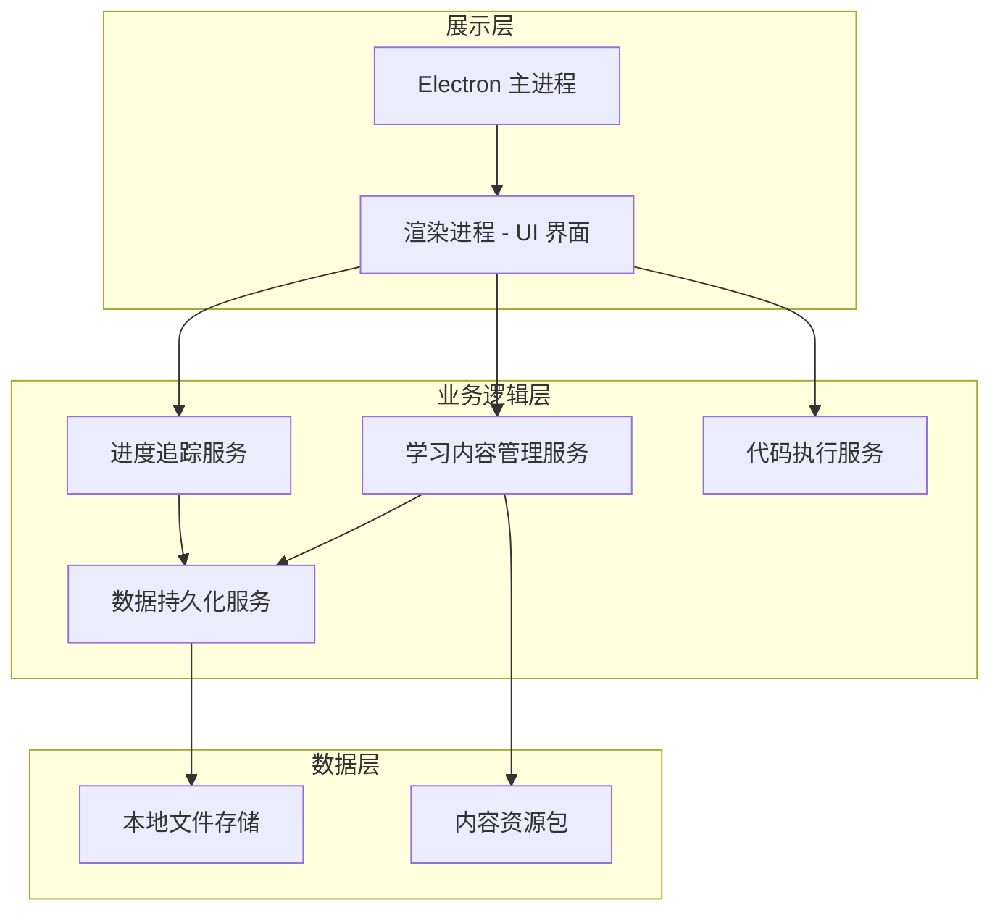
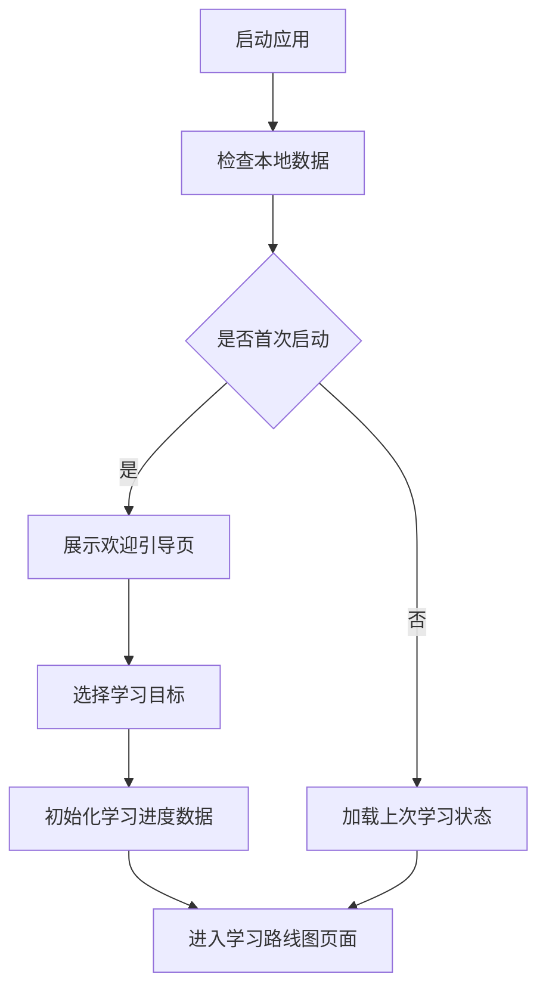
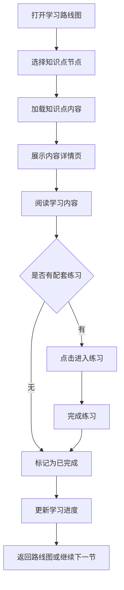
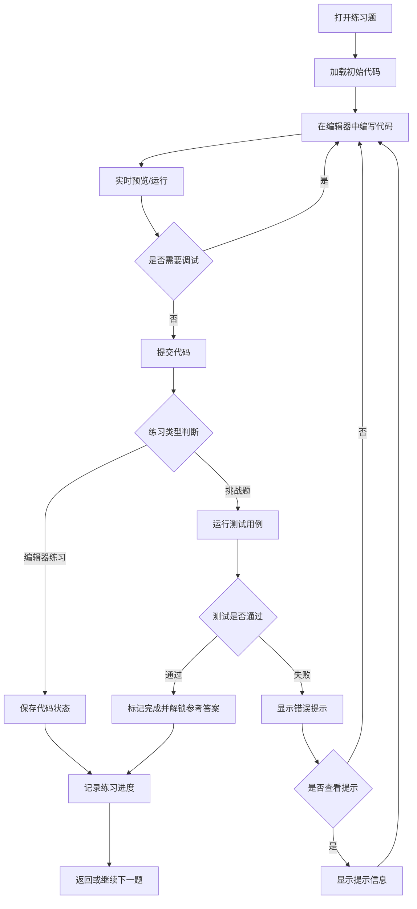
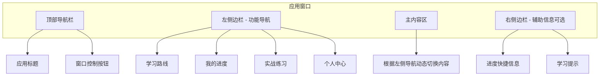

# 前端学习路线桌面应用

## 项目简介

这是一个基于 Electron 的前端学习路线桌面应用,为前端学习者提供系统化的学习路径、知识点讲解和实战练习。

## ✨ 核心特性

- 🎯 **系统化学习路径**: 从零基础到高级工程师的完整学习路线
- 📚 **丰富的课程内容**: Markdown 格式讲解,代码语法高亮
- 💻 **实战练习**: 在线代码编辑器,即时预览运行结果
- 📊 **进度追踪**: 学习进度可视化,成就徽章系统
- 🌓 **主题切换**: 支持浅色/深色模式
- 💾 **数据管理**: 学习数据导入导出,云端同步
- 🚀 **本地运行**: 无需联网,专注学习

## 🛠️ 技术栈

- **桌面框架**: Electron 28.x
- **前端框架**: React 18.2
- **构建工具**: Vite 5.x
- **开发语言**: TypeScript 5.x
- **状态管理**: Zustand 4.x
- **UI 组件库**: Ant Design 5.x
- **样式方案**: Tailwind CSS 3.x
- **代码编辑器**: Monaco Editor
- **Markdown 渲染**: react-markdown + react-syntax-highlighter

## 📦 快速开始

### 环境要求

- Node.js >= 16.x
- pnpm (推荐) 或 npm

### 安装依赖

```bash
# 克隆项目
git clone <repository-url>
cd st

# 安装依赖
pnpm install
# 或
npm install
```

### 开发模式

```bash
# 启动开发服务器
pnpm run dev

# 启动 Electron 应用
pnpm run electron:dev
```

### 构建打包

```bash
# 构建 Windows 安装包
pnpm run build:win

# 构建输出位于 release/ 目录
```

## 📖 文档

- [安装指南](./INSTALL.md) - 详细的安装和运行说明
- [使用手册](./USER_GUIDE.md) - 完整的功能使用指南
- [设计文档](./DESIGN.md) - 原始设计文档(见文档末尾)

## 🎓 学习路线

### 基础入门
- HTML 基础
- CSS 基础
- JavaScript 基础

### 进阶提升  
- ES6+ 现代 JavaScript
- 前端工程化
- React 框架基础

### 高级深化
- React 进阶核心
- 状态管理
- TypeScript + React

### 实际业务场景
- Canvas 数据可视化
- 微前端架构
- 复杂表单和文件处理

## 🗂️ 项目结构

```
st/
├── electron/              # Electron 主进程
│   ├── main.ts           # 主进程入口
│   └── preload.ts        # 预加载脚本
├── src/                  # React 应用源码
│   ├── components/       # 组件
│   ├── data/             # 数据文件
│   ├── pages/            # 页面组件
│   ├── store/            # 状态管理
│   ├── types/            # 类型定义
│   └── App.tsx           # 应用入口
├── public/               # 静态资源
├── package.json          # 项目配置
├── vite.config.ts        # Vite 配置
└── tsconfig.json         # TypeScript 配置
```

## 🎯 开发进度

### 已完成

- ✅ 项目基础架构搭建
- ✅ Electron + React + Vite 集成
- ✅ 主界面布局和路由
- ✅ Zustand 状态管理
- ✅ Tailwind CSS 样式系统
- ✅ 学习路线图可视化
- ✅ 课程内容展示
- ✅ Markdown 内容渲染
- ✅ 代码语法高亮
- ✅ 学习进度追踪
- ✅ 主题切换功能
- ✅ 数据导入导出

### 开发中

- ⏳ Monaco Editor 代码编辑器集成
- ⏳ 在线代码编辑器练习功能
- ⏳ 代码实时预览机制
- ⏳ 挑战题测试验证
- ⏳ 补充更多课程内容

### 计划中

- 📋 完善练习题库
- 📋 项目实战案例
- 📋 学习数据可视化图表
- 📋 成就系统完善
- 📋 应用性能优化

## 🤝 贡献指南

欢迎提交 Issue 和 Pull Request!

1. Fork 本仓库
2. 创建特性分支 (`git checkout -b feature/AmazingFeature`)
3. 提交更改 (`git commit -m 'Add some AmazingFeature'`)
4. 推送到分支 (`git push origin feature/AmazingFeature`)
5. 提交 Pull Request

## 📝 许可证

MIT License

---

## 附录:原始设计文档


## 项目概述

### 项目愿景
构建一个基于 Electron 的前端学习路线桌面应用，为前端学习者提供系统化的学习路径、知识点讲解和实战练习，帮助用户从零基础到进阶全面掌握前端开发技能。

### 核心价值
- **系统化学习路径**: 提供清晰的前端技术学习路线图，避免学习迷茫
- **理论与实践结合**: 知识点讲解配合即时实战练习，强化学习效果
- **本地化体验**: 桌面应用形式，无需联网即可学习，专注度更高
- **进度可视化**: 学习进度实时记录，激励持续学习

### 目标用户
- 前端零基础初学者
- 有一定基础希望系统化学习的开发者
- 需要进阶提升的前端工程师

## 功能架构

### 核心功能模块

#### 1. 学习路线图模块
**功能目标**: 为用户呈现清晰的前端技术学习路径，帮助用户理解学习顺序和知识体系

**主要能力**:
- 展示前端技术知识树状结构图
- 按难度分级显示学习阶段（基础、进阶、高级）
- 可视化标记已完成和未完成的知识点
- 支持点击知识节点快速跳转到对应学习内容
- 显示每个阶段的预估学习时长

**学习路线分级结构**:

| 阶段 | 包含内容 | 学习目标 |
|------|---------|---------|
| 基础入门 | HTML、CSS、JavaScript 基础 | 掌握网页开发基本技能 |
| 进阶提升 | ES6+、前端工程化、React 框架基础 | 具备现代前端开发能力 |
| 高级深化 | React 进阶、TypeScript、状态管理、性能优化 | 成为高级前端工程师 |
| 工程实践 | 项目构建、部署、测试、CI/CD | 掌握完整项目开发流程 |
| 实际业务场景 | Canvas、微前端、文件处理、复杂交互等 | 解决实际业务难点和复杂场景 |

#### 2. 知识点讲解模块
**功能目标**: 提供结构化的知识内容呈现，支持多种媒体形式的学习材料

**内容组织方式**:
- 每个知识点包含：概念说明、应用场景、注意事项、相关知识链接
- 支持文本、图片、代码示例的混合展示
- 代码示例支持语法高亮显示
- 关键概念提供专业术语解释
- 提供知识点之间的关联导航

**内容呈现策略**:
- 采用左侧导航树 + 右侧内容区的经典布局
- 支持章节内容的顺序导航（上一节/下一节）
- 内容支持搜索和快速定位
- 重点内容高亮标记
- 支持字体大小调节以适应不同阅读习惯

#### 3. 实战练习模块
**功能目标**: 提供交互式编程环境，让用户在实践中巩固知识

**练习类型**:

| 类型 | 适用场景 | 交互方式 |
|------|---------|---------|
| 在线编辑器练习 | HTML/CSS/JavaScript 简单片段 | 内置代码编辑器 + 实时预览 |
| 挑战题 | 算法、逻辑训练 | 题目描述 + 代码编辑器 + 测试用例验证 |
| 项目实战 | 综合应用能力训练 | 提供项目需求和初始模板，引导本地开发 |

**在线编辑器能力**:
- 提供 HTML、CSS、JavaScript 三栏编辑区
- 支持实时预览运行结果
- 代码语法高亮和基本自动补全
- 提供常见代码片段模板
- 支持代码重置和保存功能
- 控制台输出显示（用于 JavaScript 调试）

**练习验证机制**:
- 挑战题提供自动化测试用例验证
- 显示测试通过率和错误提示
- 提供参考答案查看功能（完成后解锁）
- 记录练习完成状态和提交次数

#### 4. 学习进度管理模块
**功能目标**: 追踪用户学习进度，提供学习数据分析和激励机制

**进度追踪维度**:
- 知识点完成状态（未开始、学习中、已完成）
- 练习题完成情况和正确率
- 每日学习时长统计
- 学习连续天数记录
- 各阶段完成百分比

**数据可视化**:
- 学习路线图上的进度可视化标记
- 学习时长趋势图表
- 知识模块掌握度雷达图
- 成就徽章展示

**数据持久化**:
- 所有学习数据存储在本地文件系统
- 采用 JSON 格式存储用户配置和进度数据
- 提供数据导出功能（JSON 格式）
- 支持数据导入恢复学习进度

#### 5. 个人中心模块
**功能目标**: 提供用户偏好设置和学习数据管理入口

**功能清单**:
- 应用主题切换（浅色/深色模式）
- 字体大小调节
- 代码编辑器主题选择
- 学习数据导出/导入
- 学习进度清空重置
- 应用版本信息和更新说明

## 技术架构设计

### 应用架构分层



### 主要技术选型

| 技术领域 | 选型方案 | 选型理由 |
|---------|---------|---------|
| 桌面框架 | Electron | 前端技术栈友好，生态成熟，Windows 平台支持完善 |
| UI 框架 | React 18 | 组件化开发，生态丰富，社区活跃 |
| 包管理器 | pnpm | 快速、节省磁盘空间、严格的依赖管理 |
| 构建工具 | Vite | 快速的开发服务器、优化的生产构建 |
| 状态管理 | Zustand | 轻量级状态管理库，API 简洁，适合中小型应用 |
| 代码编辑器 | Monaco Editor | VS Code 同款编辑器，功能强大 |
| 样式方案 | Tailwind CSS + 组件库（Ant Design） | 快速开发，样式一致性好，Windows 风格适配 |
| 数据存储 | electron-store | 简单的本地键值存储，适合配置和进度数据 |
| Markdown 渲染 | react-markdown + highlight.js | 支持知识点内容的富文本展示，React 生态组件 |

### 进程通信设计

**主进程职责**:
- 窗口生命周期管理
- 文件系统访问
- 菜单和系统托盘管理
- 应用更新检查

**渲染进程职责**:
- UI 界面渲染和交互
- 业务逻辑处理
- 学习内容展示

**通信机制**:
- 使用 Electron IPC 进行主进程与渲染进程通信
- 渲染进程通过 contextBridge 安全调用主进程 API
- 文件读写操作统一在主进程处理

## 数据模型设计

### 学习内容数据结构

**学习路线节点**:

| 字段名 | 类型 | 说明 |
|--------|------|------|
| id | 字符串 | 唯一标识符 |
| title | 字符串 | 节点标题 |
| level | 枚举 | 难度级别（beginner/intermediate/advanced/practical/business） |
| children | 数组 | 子节点列表 |
| contentType | 枚举 | 内容类型（chapter/lesson） |
| estimatedTime | 数字 | 预估学习时长（分钟） |

**知识点内容**:

| 字段名 | 类型 | 说明 |
|--------|------|------|
| id | 字符串 | 知识点唯一标识 |
| title | 字符串 | 知识点标题 |
| content | 字符串 | Markdown 格式的内容 |
| codeExamples | 数组 | 代码示例列表 |
| relatedTopics | 数组 | 相关知识点 ID 列表 |
| keywords | 数组 | 关键词标签 |

**练习题数据**:

| 字段名 | 类型 | 说明 |
|--------|------|------|
| id | 字符串 | 练习题唯一标识 |
| type | 枚举 | 练习类型（editor/challenge/project） |
| title | 字符串 | 练习标题 |
| description | 字符串 | 题目描述 |
| difficulty | 枚举 | 难度（easy/medium/hard） |
| initialCode | 对象 | 初始代码（HTML/CSS/JS） |
| testCases | 数组 | 测试用例（仅 challenge 类型） |
| referenceAnswer | 对象 | 参考答案 |
| hints | 数组 | 提示信息列表 |

### 用户进度数据结构

**学习进度记录**:

| 字段名 | 类型 | 说明 |
|--------|------|------|
| lessonId | 字符串 | 知识点 ID |
| status | 枚举 | 状态（not_started/in_progress/completed） |
| lastVisitTime | 时间戳 | 最后访问时间 |
| readingProgress | 数字 | 阅读进度百分比 |
| notes | 字符串 | 用户笔记 |

**练习完成记录**:

| 字段名 | 类型 | 说明 |
|--------|------|------|
| exerciseId | 字符串 | 练习题 ID |
| completed | 布尔值 | 是否完成 |
| attemptCount | 数字 | 尝试次数 |
| lastCode | 对象 | 最后提交的代码 |
| completedTime | 时间戳 | 完成时间 |
| testPassRate | 数字 | 测试通过率 |

**学习统计数据**:

| 字段名 | 类型 | 说明 |
|--------|------|------|
| totalStudyTime | 数字 | 总学习时长（秒） |
| continuousDays | 数字 | 连续学习天数 |
| dailyRecords | 数组 | 每日学习记录 |
| completedLessons | 数字 | 完成课程数 |
| completedExercises | 数字 | 完成练习数 |
| achievements | 数组 | 获得的成就列表 |

## 用户交互流程

### 首次启动流程



### 学习内容浏览流程



### 实战练习完成流程



## 界面布局设计

### 主界面布局结构



### 学习路线图页面布局

**布局特点**:
- 采用思维导图或树状图形式展示知识体系
- 节点大小区分章节和课程层级
- 颜色标识完成状态（灰色-未开始，蓝色-进行中，绿色-已完成）
- 支持节点折叠/展开
- 点击节点弹出快速预览卡片
- 提供整体进度百分比展示

### 知识点详情页布局

**布局特点**:
- 左侧：章节目录树（固定显示当前位置）
- 中间：内容展示区（占主要宽度）
- 右侧：目录锚点导航（可选显示）
- 底部：上一节/下一节导航按钮
- 顶部：面包屑导航显示当前位置

### 实战练习页布局

**编辑器练习布局**:
- 上方：题目描述区（可折叠）
- 中间：三栏代码编辑器（HTML | CSS | JavaScript）
- 下方：预览区域 + 控制台输出
- 工具栏：运行、重置、保存、查看答案按钮

**挑战题布局**:
- 左侧：题目描述、测试用例、提示
- 右侧：代码编辑器
- 底部：提交按钮、测试结果展示区

## 内容规划

### 学习路线内容大纲

#### 基础入门阶段

**HTML 基础**:
- HTML 文档结构
- 常用标签和语义化
- 表单和输入元素
- 多媒体元素
- HTML5 新特性

**CSS 基础**:
- CSS 选择器
- 盒模型和布局
- 定位机制
- 浮动和清除浮动
- Flexbox 布局
- Grid 布局
- 响应式设计基础
- CSS3 动画和过渡

**JavaScript 基础**:
- 变量和数据类型
- 运算符和表达式
- 流程控制
- 函数和作用域
- 数组和对象
- DOM 操作
- 事件处理
- 异步编程基础（回调、Promise）

#### 进阶提升阶段

**ES6+ 现代 JavaScript**:
- let、const 和块级作用域
- 箭头函数
- 解构赋值
- 模板字符串
- 扩展运算符
- 模块化（import/export）
- Class 类
- async/await

**前端工程化**:
- 包管理器（pnpm - 项目统一使用）
- 模块打包工具（Vite - 项目统一使用）
- 代码规范和 Lint 工具（ESLint/Prettier）
- 版本控制（Git）
- 构建和部署流程

**React 框架基础**:
- React 核心概念和虚拟 DOM
- JSX 语法和表达式
- 组件基础（函数组件与类组件）
- Props 和 State
- 事件处理
- 条件渲染和列表渲染
- 表单处理
- 组件生命周期

#### 高级深化阶段

**React 进阶核心**:
- Hooks 深入（useState、useEffect、useContext、useReducer、useMemo、useCallback）
- 自定义 Hooks 设计
- Context API 和状态提升
- 高阶组件（HOC）和 Render Props
- React.memo 和性能优化
- Refs 和 DOM 操作
- 错误边界（Error Boundaries）
- Portals 传送门
- Suspense 和懒加载
- Concurrent Mode 并发模式
- React 18 新特性（useTransition、useDeferredValue）

**React 状态管理**:
- Redux 核心概念和使用
- Redux Toolkit 最佳实践
- Zustand 轻量级状态管理
- Jotai 原子化状态
- MobX 响应式状态
- 状态管理方案选型

**React Router**:
- 路由基础配置
- 动态路由和嵌套路由
- 路由守卫和权限控制
- 路由懒加载
- 编程式导航

**TypeScript + React**:
- React 组件类型定义
- Props 和 State 类型约束
- Hooks 类型推断
- 泛型组件设计
- 类型安全的事件处理
- 第三方库类型声明

**React 性能优化**:
- 性能分析工具（React DevTools Profiler）
- 虚拟列表和大数据渲染
- 组件渲染优化策略
- 代码分割和懒加载
- 图片和资源优化
- 防抖和节流应用
- Web Workers 应用

#### 工程实践阶段

**项目构建**:
- Create React App 和自定义配置
- Vite React 项目搭建
- 环境变量配置
- 多环境构建策略
- 构建优化和打包分析
- Tree Shaking 和代码分割

**测试**:
- Jest 单元测试
- React Testing Library 组件测试
- Hooks 测试
- Mock 和数据模拟
- 测试覆盖率
- E2E 测试（Cypress/Playwright）

**部署和运维**:
- 前端部署方案（静态托管、CDN）
- CI/CD 流程配置
- Docker 容器化部署
- 监控和错误追踪
- 性能监控和日志分析

#### 实际业务场景阶段

**复杂表单处理**:
- 动态表单设计
- 表单验证方案（Formik、React Hook Form）
- 大型表单性能优化
- 表单联动和级联
- 文件上传和预览
- 富文本编辑器集成

**数据可视化**:
- Canvas 基础绘图
- Canvas 高级应用（图表、动画）
- ECharts/Recharts 图表库集成
- D3.js 数据可视化
- WebGL 和 Three.js 3D 可视化
- 大屏数据展示方案
- 实时数据刷新处理

**微前端架构**:
- 微前端概念和应用场景
- qiankun 微前端框架
- Module Federation 模块联邦
- iframe 通信和沙箱隔离
- Web Components 微前端方案
- 微前端应用间通信
- 公共依赖处理和版本管理
- 微前端部署策略

**跨端通信方案**:
- iframe 跨域通信（postMessage）
- Web Workers 多线程
- Service Worker 离线缓存
- WebSocket 实时通信
- Server-Sent Events（SSE）
- 长轮询和短轮询

**文件处理**:
- 大文件上传（分片上传、断点续传）
- 文件下载和导出
- Excel 导入导出（SheetJS）
- PDF 预览和生成
- 图片裁剪和压缩
- 拖拽上传实现

**权限和安全**:
- 路由级权限控制
- 按钮级权限控制
- RBAC 权限模型
- Token 管理和刷新
- XSS 和 CSRF 防护
- 敏感信息加密
- 水印和防截图方案

**复杂交互场景**:
- 虚拟滚动和无限滚动
- 拖拽排序（react-dnd、dnd-kit）
- 表格高级功能（固定列、合并单元格、虚拟滚动）
- 树形结构操作
- 富交互编辑器（流程图、脑图）
- 移动端手势处理

**性能极致优化**:
- 首屏加载优化实战
- 长列表性能优化
- 内存泄漏排查和优化
- 打包体积优化
- SSR/SSG 服务端渲染
- 预渲染和预加载策略
- CDN 和缓存策略

**低代码和动态渲染**:
- JSON Schema 动态表单
- 配置化页面渲染
- 拖拽式页面搭建
- 动态组件加载
- 插件化架构设计

**跨平台方案**:
- Electron 桌面应用开发
- React Native 移动端开发
- Tauri 轻量级桌面方案
- PWA 渐进式 Web 应用

### 练习题库规划

**练习题数量分布**:

| 阶段 | 编辑器练习 | 挑战题 | 项目实战 |
|------|-----------|--------|---------|
| 基础入门 | 50+ | 30+ | 3 |
| 进阶提升 | 40+ | 40+ | 5 |
| 高级深化 | 30+ | 40+ | 5 |
| 工程实践 | 20+ | 30+ | 5 |
| 实际业务场景 | 25+ | 35+ | 8 |

**练习题设计原则**:
- 由浅入深，每个知识点配套对应练习
- 注重实用性，模拟真实开发场景
- 提供详细的提示和参考答案
- 挑战题覆盖常见算法和逻辑问题
- 项目实战贴近实际应用需求

## 应用特性设计

### 离线可用性
- 所有学习内容预置在应用安装包中
- 无需网络连接即可完成所有学习任务
- 代码编辑和预览完全本地执行

### 学习激励机制
- 连续学习天数统计和提醒
- 完成里程碑解锁成就徽章
- 学习时长和完成进度可视化
- 每日学习目标设定和达成提示

### 个性化设置
- 主题模式切换（浅色/深色/自动跟随系统）
- 代码编辑器配置（字体、主题、快捷键）
- 内容字体大小调节
- 学习提醒开关

### 数据管理
- 学习进度本地自动保存
- 支持手动导出学习数据（JSON 格式）
- 支持从导出文件恢复进度
- 提供进度清空重置功能

## 技术实现策略

### 代码编辑器集成方案
- 采用 Monaco Editor 作为代码编辑核心
- 配置 HTML、CSS、JavaScript 语言支持
- 启用代码提示和语法检查
- 实现代码格式化功能
- 自定义编辑器主题适配应用整体风格

### 代码预览实现方案
- 使用 iframe 沙箱环境执行用户代码
- HTML/CSS/JS 组合后注入 iframe 进行渲染
- 拦截控制台输出显示在应用内
- 提供错误捕获和友好提示
- 支持代码变更后的实时刷新

### 测试用例执行方案
- 在隔离的 JavaScript 环境中运行用户代码
- 通过预定义的输入输出对比验证结果
- 支持多组测试用例批量执行
- 显示每个测试用例的通过状态
- 提供错误详情和预期结果对比

### 内容搜索实现方案
- 对所有知识点内容建立索引
- 支持标题和正文内容的关键词搜索
- 搜索结果高亮显示匹配关键词
- 提供搜索历史记录

### 数据持久化方案
- 使用 electron-store 存储用户配置和进度
- 配置文件存储在用户目录的应用专用文件夹
- 学习内容以 JSON 文件形式组织在应用资源目录
- 用户笔记和代码草稿单独存储便于管理

### 应用打包和分发

### 打包策略
- 使用 electron-builder 进行应用打包
- 目标平台：仅支持 Windows
- 生成安装包格式：Windows exe 安装程序（支持 NSIS 安装向导）
- 应用图标和安装界面自定义设计，符合 Windows 应用规范
- 支持 Windows 10/11 系统

### 版本管理
- 采用语义化版本号规则
- 在应用内显示当前版本信息
- 提供更新日志查看功能

### 应用体积优化
- 代码分割和按需加载
- 资源文件压缩
- 依赖库优化，移除未使用的模块
- 仅打包 Windows 平台相关依赖
- 控制安装包大小在合理范围（目标 < 150MB）

## 扩展性考虑

### 内容更新扩展
- 设计可扩展的内容数据结构
- 预留内容插件机制，便于后续添加新知识模块
- 内容文件采用标准化格式，便于批量生成和维护

### 功能扩展预留
- 预留在线内容同步接口（当前版本不实现）
- 预留用户账号系统接口（当前版本不实现）
- 预留社区讨论模块入口（当前版本不实现）
- 设计模块化架构，便于后续功能插拔

### 多语言支持预留
- 界面文案采用国际化方案组织
- 当前版本仅支持中文
- 架构支持后续扩展多语言内容

## 质量保障

### 性能目标
- 应用启动时间 < 3 秒
- 页面切换响应时间 < 500ms
- 代码编辑器输入延迟 < 100ms
- 代码预览刷新时间 < 1 秒

### 稳定性要求
- 代码执行异常不影响应用主进程
- 用户数据自动保存防止意外丢失
- 异常情况下提供友好错误提示

### 用户体验原则
- 界面简洁直观，降低学习成本
- 交互反馈及时，操作流畅
- 内容排版舒适，适合长时间阅读
- 快捷键支持，提升操作效率

## 项目实施建议

### 开发阶段划分

**第一阶段 - 核心框架搭建**:
- 初始化 pnpm 项目并配置 Electron + Vite + React 18 基础架构
- 实现主进程和渲染进程通信机制
- 完成主界面布局和 React Router 路由框架
- 集成 Zustand 状态管理
- 集成 Monaco Editor 代码编辑器

**第二阶段 - 学习路线和内容展示**:
- 实现学习路线图可视化组件
- 完成知识点内容展示页面
- 实现 Markdown 内容渲染
- 准备基础阶段的学习内容

**第三阶段 - 实战练习功能**:
- 实现在线代码编辑器练习功能
- 实现代码实时预览机制
- 实现挑战题测试用例验证
- 准备配套练习题库

**第四阶段 - 进度管理和数据持久化**:
- 实现学习进度追踪功能
- 完成数据本地存储
- 实现学习统计和可视化
- 完成数据导入导出功能

**第五阶段 - 完善和优化**:
- 补充进阶和高级阶段内容
- 性能优化和体验打磨
- 应用打包和安装测试
- 编写用户使用文档

### 风险和挑战

| 风险项 | 影响 | 应对策略 |
|--------|------|---------|
| 内容准备工作量大 | 延长开发周期 | 分阶段发布，优先完成基础内容 |
| Monaco Editor 集成复杂度 | 技术实现难度 | 提前技术预研，参考成熟案例 |
| 代码执行安全性 | 用户体验和安全 | 使用沙箱隔离，限制危险操作 |
| 应用体积过大 | 用户下载和安装体验 | 优化资源打包，代码分割，仅打包 Windows 依赖 |
| Windows 系统兼容性 | 不同 Windows 版本表现差异 | 在 Windows 10/11 上充分测试 |

## 成功度量指标

- 用户完成至少一个完整学习阶段的比例
- 用户平均学习时长
- 练习题完成率
- 用户连续使用天数
- 应用启动和使用流畅度评价
- 生成安装包格式：Windows exe 安装程序（支持 NSIS 安装向导）
- 应用图标和安装界面自定义设计，符合 Windows 应用规范
- 支持 Windows 10/11 系统

### 版本管理
- 采用语义化版本号规则
- 在应用内显示当前版本信息
- 提供更新日志查看功能

### 应用体积优化
- 代码分割和按需加载
- 资源文件压缩
- 依赖库优化，移除未使用的模块
- 仅打包 Windows 平台相关依赖
- 控制安装包大小在合理范围（目标 < 150MB）

## 扩展性考虑

### 内容更新扩展
- 设计可扩展的内容数据结构
- 预留内容插件机制，便于后续添加新知识模块
- 内容文件采用标准化格式，便于批量生成和维护

### 功能扩展预留
- 预留在线内容同步接口（当前版本不实现）
- 预留用户账号系统接口（当前版本不实现）
- 预留社区讨论模块入口（当前版本不实现）
- 设计模块化架构，便于后续功能插拔

### 多语言支持预留
- 界面文案采用国际化方案组织
- 当前版本仅支持中文
- 架构支持后续扩展多语言内容

## 质量保障

### 性能目标
- 应用启动时间 < 3 秒
- 页面切换响应时间 < 500ms
- 代码编辑器输入延迟 < 100ms
- 代码预览刷新时间 < 1 秒

### 稳定性要求
- 代码执行异常不影响应用主进程
- 用户数据自动保存防止意外丢失
- 异常情况下提供友好错误提示

### 用户体验原则
- 界面简洁直观，降低学习成本
- 交互反馈及时，操作流畅
- 内容排版舒适，适合长时间阅读
- 快捷键支持，提升操作效率

## 项目实施建议

### 开发阶段划分

**第一阶段 - 核心框架搭建**:
- 初始化 pnpm 项目并配置 Electron + Vite + React 18 基础架构
- 实现主进程和渲染进程通信机制
- 完成主界面布局和 React Router 路由框架
- 集成 Zustand 状态管理
- 集成 Monaco Editor 代码编辑器

**第二阶段 - 学习路线和内容展示**:
- 实现学习路线图可视化组件
- 完成知识点内容展示页面
- 实现 Markdown 内容渲染
- 准备基础阶段的学习内容

**第三阶段 - 实战练习功能**:
- 实现在线代码编辑器练习功能
- 实现代码实时预览机制
- 实现挑战题测试用例验证
- 准备配套练习题库

**第四阶段 - 进度管理和数据持久化**:
- 实现学习进度追踪功能
- 完成数据本地存储
- 实现学习统计和可视化
- 完成数据导入导出功能

**第五阶段 - 完善和优化**:
- 补充进阶和高级阶段内容
- 性能优化和体验打磨
- 应用打包和安装测试
- 编写用户使用文档

### 风险和挑战

| 风险项 | 影响 | 应对策略 |
|--------|------|---------|
| 内容准备工作量大 | 延长开发周期 | 分阶段发布，优先完成基础内容 |
| Monaco Editor 集成复杂度 | 技术实现难度 | 提前技术预研，参考成熟案例 |
| 代码执行安全性 | 用户体验和安全 | 使用沙箱隔离，限制危险操作 |
| 应用体积过大 | 用户下载和安装体验 | 优化资源打包，代码分割，仅打包 Windows 依赖 |
| Windows 系统兼容性 | 不同 Windows 版本表现差异 | 在 Windows 10/11 上充分测试 |

## 成功度量指标

- 用户完成至少一个完整学习阶段的比例
- 用户平均学习时长
- 练习题完成率
- 用户连续使用天数
- 应用启动和使用流畅度评价
- 应用启动和使用流畅度评价
- 应用启动和使用流畅度评价
